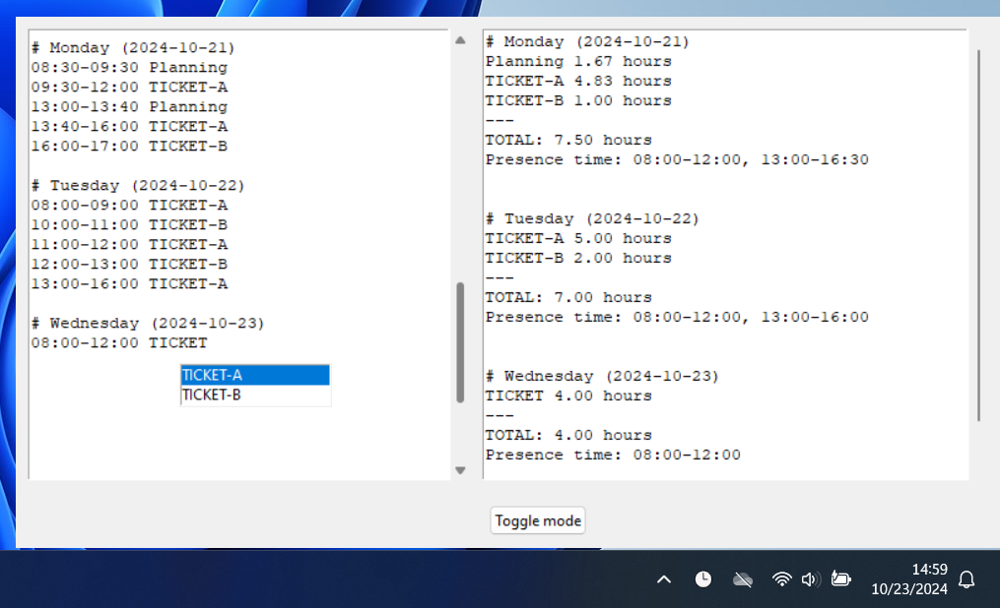

# Text-based personal time tracker

## How to use
- Show/hide the time tracker window via the clock button on the Windows tray
- Manage time entries as simple text
  - Days can be added as `# <day>`
  - Time records can be added as `hh:mm-hh:mm label`
- Get real-time aggregations automatically
  - Time spent by topic for each day. After summing up entries it ensures that sums can be represented by a decimal number in the format of `n.nn`, so it may round upwards a few minutes for each label
  - Presence time (Limitation: currently start is fixed at 8:00 and lunch break is at 12:00-13:00, end time calculated by the items.)
- State is automatically stored in a local text file
- Supports simple notes: if a day label starts with "# Note" then it will be not considered for the aggregations

## How to use
0. Requires Python 3.12.7 and PowerShell
1. Clone this repo
2. As a one-time setup, run `install.ps1` to create the virtual environment
3. Run `gui.ps1`
4. (Optional) Create a shortcut for ease of use
  1. Right-click on the `gui.ps1` file in File Explorer, then choose "Send to" > "Desktop (create shortcut)"
  2. Right-click on the created shortcut, select Properties
    - Change the "Target" Field, add "PowerShell" to the beginning, e.g., "PowerShell C:\TimeTracker\gui.ps1"
    - Change "Run" to "Minimized"
  3. Click OK
5. (Opitonal) Add the shortcut to autostart
  1. Press the Windows logo key + R, then type shell:startup
  2. Copy the shortcut you've created to the Startup folder

## TODO
- Make error handling more lenient, to be able to see the total time in case of errors 
- Add guide how to add the shortcut to autostart and hide the console window.
- Application lock to prevent multiple instances running concurrently.
- Autocomplete should suggest whole labels not just individual words
- Add config options to control behavior
  - Be able to turn off rounding
  - Configure presence time generator instead of always using the fixed lunch break 12:00-13:00
- Visualize each day with a simple chart as an overall presence time indicator for the day. 
- Add more formatting 
  - Have a different background for # Note: sections
  - Background colors for days
  - Highlight headers (in left and right)
  - Have an unique color for time blocks (hh:mm-hh:mm on the left and d.dd hours on the right) 
  - Have an unique color for each different entry type
  - Make TOTAL and Presence times also bold or underlined
